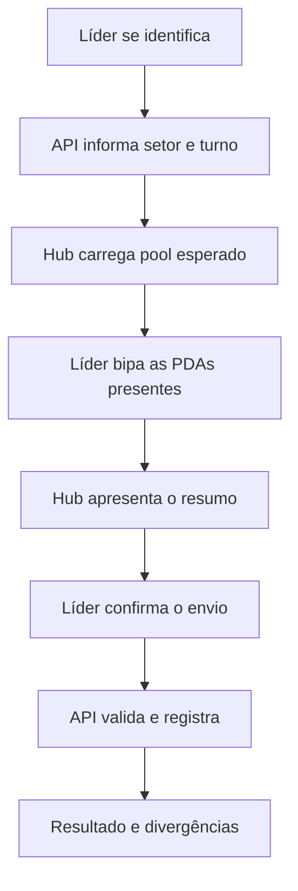
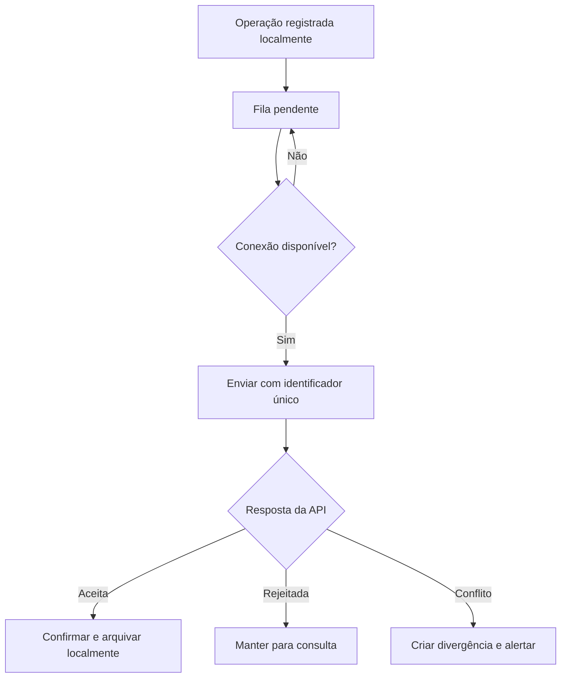

# Hub de PDAs

Documentação funcional e técnica exclusiva da aplicação **Hub de PDAs**.

> Status: planejamento. Esta documentação descreve o produto que será construído; ela não afirma que os fluxos ou contratos aqui apresentados já estejam implementados.

## 1. Objetivo

O Hub de PDAs será uma aplicação de quiosque voltada à operação física dos pools de PDAs.

Seus objetivos são:

- identificar o líder responsável pela operação;
- conferir as PDAs presentes na abertura do turno;
- permitir a conferência facultativa de encerramento;
- identificar faltas, equipamentos extras e conflitos;
- executar ações rápidas iniciadas pela bipagem de uma PDA;
- continuar coletando operações durante indisponibilidades temporárias da API;
- sincronizar posteriormente sem ocultar ou sobrescrever conflitos;
- manter rastreabilidade sobre responsável, setor, turno, equipamento e horário.

O Hub não será o sistema administrativo completo da operação. Ele será uma interface rápida, orientada a leitor de código de barras e adequada ao uso no chão de operação.

## 2. Limites da aplicação

### 2.1 Faz parte do Hub

- identificação do líder;
- descoberta do setor e turno autorizados;
- conferência de abertura;
- conferência facultativa de encerramento;
- bipagem em lote;
- comparação entre estoque esperado e estoque encontrado;
- consulta rápida da situação de uma PDA;
- empréstimo temporário;
- recebimento e devolução de empréstimo;
- marcação de indisponibilidade e retorno à disponibilidade;
- envio para manutenção;
- fila offline e sincronização;
- apresentação de divergências encontradas durante a operação.

### 2.2 Não faz parte do Hub

- cadastro administrativo de usuários;
- criação de líderes ou supervisores;
- administração de setores e turnos;
- transferência permanente entre setores;
- regularização definitiva de divergências;
- cadastro patrimonial completo de ativos;
- diagnóstico e reparo técnico;
- baixa patrimonial;
- atendimento de chamados;
- Kanban e tarefas internas da T.I.;
- relatórios administrativos completos.

Essas responsabilidades pertencem, respectivamente, à **Gestão Operacional**, à **Gestão de Ativos da T.I.**, ao **Atendimento ITSM** e ao **Planner da T.I.**

## 3. Princípios obrigatórios

1. A API central é a fonte de verdade.
2. A interface nunca concede autorização por conta própria.
3. PDAs pertencem a pools setoriais, não a operadores individuais.
4. A abertura do turno exige conferência.
5. O encerramento é facultativo.
6. Toda ação que altera estado exige um responsável identificado.
7. Uma PDA de outro setor não é transferida automaticamente.
8. Uma PDA ausente não é classificada automaticamente como perdida.
9. Conflitos offline nunca são sobrescritos silenciosamente.
10. Histórico e auditoria não são apagados pelo Hub.

## 4. Usuários

### 4.1 Líder de setor

É o usuário principal do Hub.

Pode atuar somente nos setores e turnos abrangidos por seus acessos:

- realizar conferências;
- consultar o pool esperado;
- autorizar empréstimos temporários;
- receber e devolver empréstimos;
- marcar uma PDA como indisponível;
- tornar uma PDA disponível novamente;
- enviar uma PDA para manutenção;
- consultar a situação operacional de uma PDA.

### 4.2 Supervisor

O supervisor poderá utilizar o Hub quando também precisar executar ou acompanhar uma operação física autorizada. A visão administrativa global continuará pertencendo à aplicação Gestão Operacional.

### 4.3 Operador comum

Não utiliza o Hub para retirada ou devolução individual de PDA. O projeto não rastreará qual operador utilizou determinada PDA durante o turno nesta primeira versão.

## 5. Formato da aplicação

O Hub deverá ser uma aplicação web instalável, adequada ao modo quiosque e com suporte offline.

Requisitos de experiência:

- funcionar em computador ou tablet;
- aceitar leitor configurado como teclado;
- manter o campo de bipagem sempre pronto para receber leitura;
- usar botões grandes e mensagens curtas;
- responder visualmente e por som a cada leitura;
- funcionar em tela cheia;
- impedir navegação acidental para fora do fluxo;
- indicar claramente quando estiver offline;
- permitir simulação de leitura durante o desenvolvimento.

A escolha do framework de frontend ainda não está definida por esta documentação. A tecnologia escolhida deverá suportar PWA, armazenamento local seguro e sincronização em segundo plano.

## 6. Contexto operacional

Depois da identificação, a API deverá informar:

- usuário autenticado;
- papel e permissões;
- setores autorizados;
- turno atual ou turnos disponíveis;
- conferência pendente;
- última sincronização;
- resumo do pool;
- operações offline ainda não confirmadas.

Se o líder possuir mais de um setor ou turno válido, o Hub solicitará a seleção antes de iniciar uma operação.

## 7. Mapa de telas

| Código | Tela | Finalidade |
| --- | --- | --- |
| HUB-01 | Identificação | Identificar o líder por matrícula ou crachá |
| HUB-02 | Seleção de contexto | Escolher setor e turno quando houver mais de uma opção |
| HUB-03 | Início | Mostrar situação atual, pendências e ações disponíveis |
| HUB-04 | Conferência | Realizar a bipagem em lote |
| HUB-05 | Resumo da conferência | Revisar confirmadas, ausentes, extras e conflitos |
| HUB-06 | Resultado enviado | Informar aceite, rejeições e divergências criadas pela API |
| HUB-07 | Menu da PDA | Exibir ações rápidas depois da bipagem de um equipamento |
| HUB-08 | Empréstimo | Registrar destino, motivo e previsão de devolução |
| HUB-09 | Recebimento ou devolução | Confirmar fisicamente uma movimentação temporária |
| HUB-10 | Indisponibilidade | Marcar ou remover indisponibilidade com motivo |
| HUB-11 | Envio para manutenção | Registrar o encaminhamento físico para a T.I. |
| HUB-12 | Consulta da PDA | Mostrar situação atual e últimas movimentações relevantes |
| HUB-13 | Fila offline | Mostrar operações aguardando sincronização |
| HUB-14 | Conflitos de sincronização | Apresentar operações rejeitadas ou convertidas em divergência |

## 8. Detalhamento das telas

### HUB-01 — Identificação

Elementos:

- estado de conexão;
- horário do dispositivo;
- campo permanentemente focado para bipagem;
- opção controlada para digitar a matrícula;
- identificação do terminal;
- mensagem de erro sem revelar informações sensíveis.

Resultados possíveis:

- líder identificado;
- matrícula inexistente;
- usuário inativo;
- usuário sem permissão;
- usuário com mais de um contexto possível;
- API indisponível.

### HUB-02 — Seleção de contexto

Exibida somente quando necessário.

O líder seleciona:

- setor;
- turno;
- tipo de operação, quando aplicável.

O Hub não deve permitir a seleção de um contexto fora do escopo devolvido pela API.

### HUB-03 — Início

Deve mostrar:

- líder identificado;
- setor e turno;
- status online ou offline;
- última sincronização;
- quantidade esperada no pool;
- situação da abertura do turno;
- encerramento anterior, quando existir;
- divergências relevantes;
- operações pendentes de sincronização.

Ações principais:

- iniciar ou continuar abertura;
- iniciar encerramento;
- bipar PDA para ação rápida;
- consultar fila offline;
- encerrar sessão.

### HUB-04 — Conferência

Durante a leitura, mostrar:

- quantidade esperada;
- quantidade lida;
- quantidade válida;
- última PDA lida;
- resultado imediato da leitura;
- lista compacta das leituras recentes;
- opção de desfazer a última leitura antes do envio;
- opção de pausar ou cancelar a sessão conforme regra definida.

Cada leitura deve possuir:

- identificador local;
- valor bruto lido;
- código normalizado;
- horário do dispositivo;
- resultado preliminar;
- resultado definitivo da API, quando online.

### HUB-05 — Resumo da conferência

Separar em grupos:

- confirmadas;
- ausentes;
- duplicadas;
- não cadastradas;
- de outro setor;
- emprestadas;
- indisponíveis;
- em manutenção;
- baixadas;
- conflitos de localização.

O envio exige confirmação explícita do líder.

### HUB-06 — Resultado enviado

A API poderá:

- aceitar a conferência;
- aceitar e criar divergências;
- rejeitar leituras específicas;
- rejeitar a sessão por contexto inválido;
- detectar que a operação já foi processada;
- solicitar atualização do contexto.

O Hub deverá apresentar o resultado real da API, não apenas o resultado calculado localmente.

### HUB-07 — Menu da PDA

No estado inicial, bipar uma PDA fora de uma conferência abre o menu de ações.

Ações possíveis conforme situação e permissão:

- consultar situação;
- emprestar;
- confirmar recebimento;
- devolver empréstimo;
- enviar para manutenção;
- marcar indisponível;
- tornar disponível;
- reimprimir etiqueta futuramente.

Ações não permitidas não devem ser exibidas. A API ainda realizará a validação definitiva.

### HUB-08 — Empréstimo

Campos:

- PDA;
- setor de origem;
- setor de destino;
- líder responsável;
- motivo obrigatório;
- previsão opcional de devolução.

O empréstimo cria uma movimentação em trânsito. O equipamento somente passa à custódia temporária do destino depois da confirmação física de recebimento.

### HUB-09 — Recebimento ou devolução

A confirmação deverá mostrar:

- equipamento;
- origem;
- destino;
- tipo de movimentação;
- responsável que iniciou;
- data e hora;
- observação relevante.

A responsabilidade física muda somente depois da confirmação de quem recebe.

### HUB-10 — Indisponibilidade

Marcar como indisponível exige motivo.

A PDA:

- continua pertencendo ao setor;
- continua fisicamente esperada;
- permanece nas conferências;
- deixa de contar como disponibilidade operacional.

O retorno à disponibilidade também deve ser auditado.

### HUB-11 — Envio para manutenção

Depois do envio:

- a PDA sai do pool operacional;
- deixa de ser esperada nas conferências futuras;
- fica aguardando recebimento pela T.I.;
- o último responsável permanece registrado até a confirmação da T.I.

O diagnóstico e o reparo ocorrerão na Gestão de Ativos da T.I.

### HUB-12 — Consulta da PDA

Informações mínimas:

- número de série;
- patrimônio, quando existir;
- tipo e modelo;
- situação patrimonial;
- disponibilidade;
- setor permanente;
- custódia atual;
- movimentação temporária;
- condição técnica;
- últimas movimentações relevantes.

### HUB-13 — Fila offline

Deve mostrar:

- número de operações pendentes;
- horário da operação mais antiga;
- tentativas de sincronização;
- operações aguardando;
- operações em envio;
- operações confirmadas;
- operações com conflito.

Uma operação só poderá ser removida da fila depois da confirmação da API.

### HUB-14 — Conflitos de sincronização

O Hub deverá diferenciar:

- operação aceita;
- operação já processada;
- operação rejeitada;
- operação convertida em divergência;
- operação que exige análise no sistema Gestão Operacional.

O Hub não regulariza definitivamente uma divergência.

## 9. Conferência de abertura

Fluxo principal:



Regras:

- é obrigatória no início do turno;
- enquanto estiver pendente, deve permanecer destacada;
- a lista esperada considera movimentações válidas;
- a conferência não transfere equipamentos automaticamente;
- leituras incorretas não precisam interromper toda a sessão;
- a API compara o envio com o estado central mais recente.

## 10. Conferência de encerramento

O encerramento é facultativo.

Quando realizado:

- registra a situação física observada ao final do turno;
- melhora a comparação com o turno seguinte;
- preserva o líder responsável;
- pode gerar divergências.

Não realizar o encerramento não bloqueia a operação. Entretanto, uma diferença encontrada pelo turno seguinte poderá permanecer associada à responsabilidade do turno anterior até análise.

## 11. Resultados da bipagem

| Resultado | Comportamento |
| --- | --- |
| Confirmada | Contabilizar normalmente |
| Duplicada | Alertar e não contar novamente |
| Não cadastrada | Registrar leitura e destacar no resumo |
| De outro setor | Não transferir; sinalizar possível divergência |
| Em manutenção | Alertar e não considerar disponível |
| Baixada | Bloquear operação e destacar situação |
| Emprestada | Validar origem, destino e período |
| Indisponível | Contar como presente, mas não disponível |
| Conflito de localização | Registrar e encaminhar para divergência |
| Ausente | Calcular no resumo quando um item esperado não foi lido |

O resultado mostrado durante a leitura poderá ser preliminar. O resultado definitivo será o retornado pela API no envio ou sincronização.

## 12. Operação offline

O Hub poderá continuar coletando operações quando não houver comunicação com a API.

### 12.1 Regras

- mostrar permanentemente que está offline;
- informar a última sincronização;
- utilizar a última fotografia válida do contexto;
- gerar um identificador único para cada operação;
- registrar leituras e confirmações localmente;
- nunca apresentar a operação como confirmada pela central;
- enviar operações na ordem original;
- repetir envios com segurança;
- manter na fila até receber confirmação definitiva.

### 12.2 Sincronização



### 12.3 Conflitos

Exemplo: dois Hubs offline registram a mesma PDA em setores diferentes.

Nesse caso:

- nenhuma operação sobrescreve silenciosamente a outra;
- a API preserva os dois eventos;
- a PDA entra em divergência;
- os responsáveis e horários permanecem auditados;
- a regularização ocorre na Gestão Operacional.

## 13. Segurança e auditoria

A autenticação inicial por matrícula é provisória.

Antes de produção deverá ser avaliado:

- crachá seguro;
- senha;
- SSO;
- segundo fator;
- vínculo confiável entre terminal e local.

Toda operação de alteração deve registrar:

- usuário;
- papel e escopo utilizados;
- setor;
- turno;
- terminal;
- origem `HUB_PDA`;
- data e hora do dispositivo;
- data e hora do servidor;
- identificador da operação;
- estado anterior e posterior;
- motivo, quando exigido.

O armazenamento offline não deverá manter tokens ou dados sensíveis além do necessário.

## 14. Experiência de bipagem

Requisitos mínimos:

- campo de leitura com foco automático;
- processamento após `Enter` ou sufixo configurado no leitor;
- proteção contra leituras repetidas em sequência;
- retorno visual em até 200 ms para validações locais;
- retorno sonoro diferente para sucesso, alerta e erro;
- cores acompanhadas de texto e ícone;
- possibilidade de operar sem mouse;
- recuperação do foco depois de qualquer popup;
- fonte e contraste adequados ao ambiente operacional;
- confirmação adicional para ações destrutivas ou sensíveis.

## 15. Contratos previstos com a API

Os endpoints abaixo são uma proposta inicial e deverão ser validados durante o desenho da API. Eles ainda não representam contratos implementados.

```http
POST /api/v1/sessoes
GET  /api/v1/hub/contextos
GET  /api/v1/hub/contextos/{id}/resumo

POST /api/v1/conferencias
GET  /api/v1/conferencias/{id}
POST /api/v1/conferencias/{id}/leituras
POST /api/v1/conferencias/{id}/envio

GET  /api/v1/pdas/codigo/{codigo}
POST /api/v1/pdas/{id}/emprestimos
POST /api/v1/emprestimos/{id}/recebimentos
POST /api/v1/emprestimos/{id}/devolucoes
POST /api/v1/pdas/{id}/indisponibilidades
POST /api/v1/pdas/{id}/retornos-disponibilidade
POST /api/v1/pdas/{id}/envios-manutencao

POST /api/v1/hub/sincronizacoes
GET  /api/v1/hub/operacoes/{identificador}
```

Todos os comandos offline deverão aceitar uma chave de idempotência.

## 16. Estados locais

O frontend precisará distinguir:

- sessão não identificada;
- sessão autenticada;
- contexto carregando;
- contexto disponível;
- operação online;
- operação offline;
- conferência em andamento;
- conferência aguardando envio;
- sincronização em andamento;
- sincronização parcial;
- conflito;
- sessão expirada.

Dados locais mínimos:

- fotografia do último contexto válido;
- conferência ainda não enviada;
- leituras da conferência;
- fila de operações;
- respostas definitivas recebidas;
- metadados de sincronização.

## 17. Primeiro marco executável

O primeiro objetivo de desenvolvimento será permitir que o projeto seja iniciado e visualizado antes da integração completa.

Esse marco deverá entregar:

- estrutura inicial do frontend;
- comando documentado para execução local;
- tela de identificação;
- tela inicial do Hub;
- contexto simulado de setor e turno;
- simulador de bipagem por teclado;
- tela de conferência;
- resumo com dados simulados;
- indicador online e offline;
- navegação sem persistir mudanças reais na API.

Esse marco servirá para validar o fluxo visual e a experiência com o leitor. Dados simulados deverão ser claramente identificados e isolados para posterior substituição pelos contratos reais.

## 18. Etapas de entrega

### Etapa 0 — Estrutura visual executável

- definir framework;
- criar projeto e scripts de execução;
- aplicar identidade visual inicial;
- implementar as telas principais com dados simulados;
- validar uso por teclado e leitor.

### Etapa 1 — Conferência online

- integrar autenticação;
- carregar contexto real;
- abrir conferência;
- registrar leituras;
- enviar e mostrar o resultado da API.

### Etapa 2 — Ações rápidas

- consulta;
- empréstimo;
- recebimento;
- devolução;
- indisponibilidade;
- envio para manutenção.

### Etapa 3 — Operação offline

- armazenamento local;
- fila idempotente;
- sincronização;
- apresentação de rejeições e conflitos.

### Etapa 4 — Preparação operacional

- testes em dispositivo real;
- testes com leitor;
- segurança;
- observabilidade;
- instalação em modo quiosque;
- recuperação após falhas;
- documentação de suporte.

## 19. Critérios de aceite do MVP

O MVP do Hub estará funcional quando:

- o líder puder se identificar;
- o contexto autorizado vier da API;
- a abertura de turno puder ser concluída;
- leituras duplicadas não forem contabilizadas duas vezes;
- ausentes e extras forem mostrados antes do envio;
- a API puder aceitar a conferência ou criar divergências;
- a consulta rápida de uma PDA funcionar;
- empréstimo, recebimento, devolução, indisponibilidade e manutenção forem auditados;
- uma perda temporária de conexão não apagar operações;
- o reenvio da mesma operação não gerar duplicidade;
- conflitos forem apresentados sem alteração silenciosa do estado;
- o Hub puder ser operado prioritariamente pelo leitor e teclado.

## 20. Requisitos não funcionais

- interface responsiva;
- instalação como PWA;
- carregamento inicial rápido;
- funcionamento em navegadores homologados;
- tolerância a reconexões;
- idempotência;
- acessibilidade por teclado;
- logs técnicos sem dados sensíveis;
- métricas de sincronização e falhas;
- testes automatizados dos fluxos críticos;
- versionamento do formato armazenado localmente.

## 21. Decisões ainda abertas

Antes ou durante a Etapa 0, será necessário decidir:

- framework do frontend;
- dispositivo e navegador-alvo;
- modelo do leitor e sufixo utilizado;
- leitura apenas por leitor ou também por câmera;
- método inicial de identificação;
- duração da sessão e bloqueio por inatividade;
- política para cancelar uma conferência iniciada;
- necessidade de reimpressão de etiqueta no MVP;
- quantidade de dados que poderá ser mantida offline;
- período de retenção local depois da sincronização;
- comportamento quando o relógio do dispositivo estiver incorreto;
- identidade visual definitiva;
- necessidade de múltiplos idiomas.

## 22. Definição de pronto por entrega

Uma funcionalidade do Hub somente será considerada concluída quando:

- possuir regra de negócio documentada;
- validar permissão na API;
- possuir estado de carregamento, vazio e erro;
- funcionar por teclado e leitor;
- registrar auditoria quando alterar estado;
- tratar reenvio sem duplicidade;
- possuir testes automatizados relevantes;
- ter sido testada online e, quando aplicável, offline;
- atualizar esta documentação se alterar uma regra do produto.

